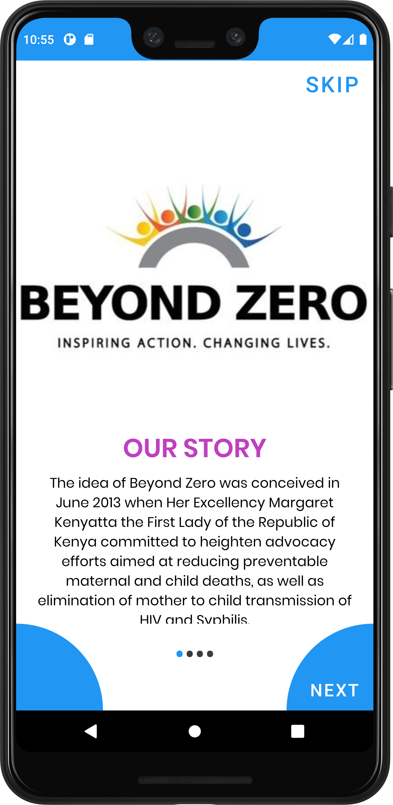
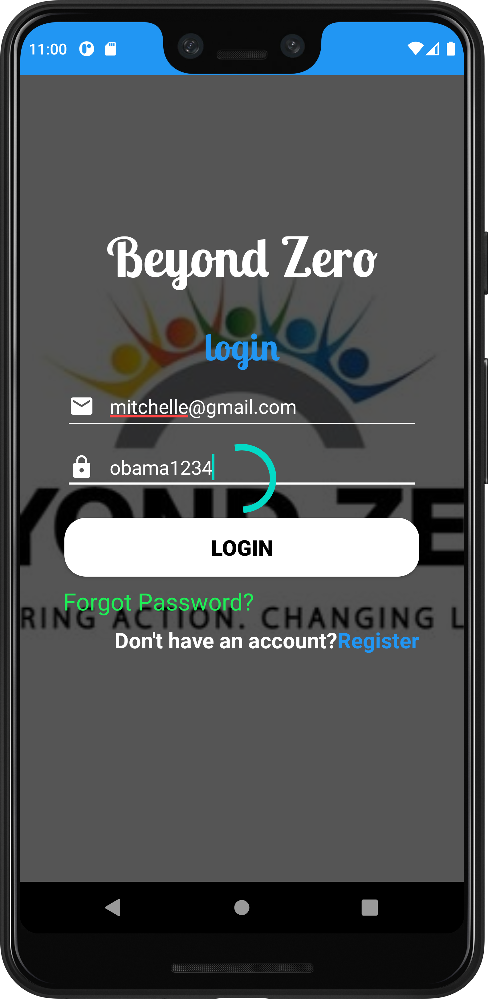
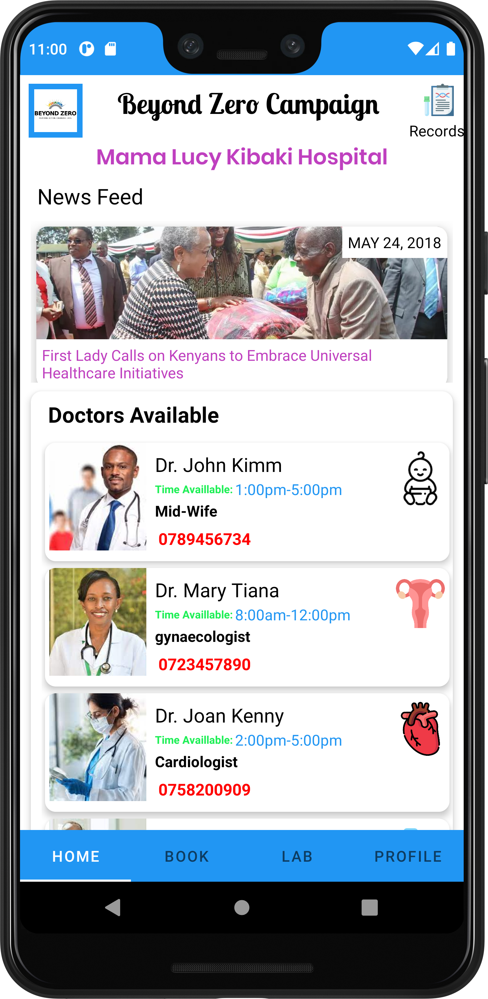
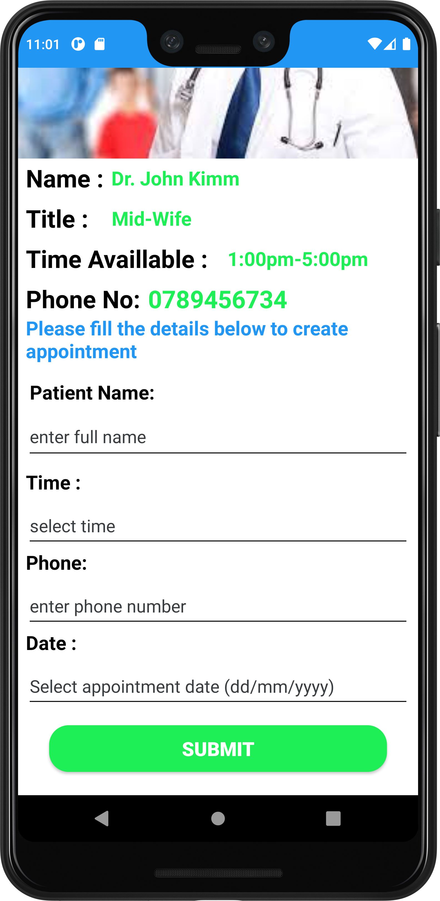
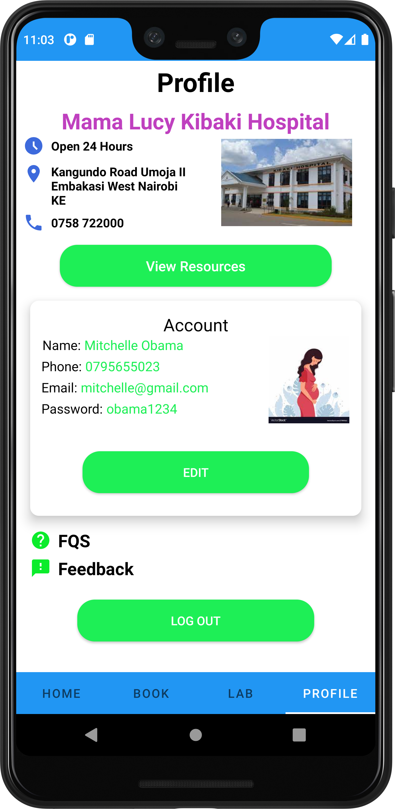

# BeyondZeroCampaign
Beyond zero health care initiative was conceived in June 2013 when her excellency
Margaret Kenyatta the former first lady of the republic of Kenya committed to heighten advocacy efforts
aimed at reducing preventable maternal and child deaths, as well as elimination of mother to
child transmission of HIV and syphilis. This defining moment was during the first lady’s
inaugural participation at the organization of African first ladies against HIV/aids (oafla
conference).

## Technologies used
* Java- `Backend.`
* Xmls- `Frontend.`
* Gradle- `(For Project building).`
* Junit- `Testing`
* Firebase- `Autentication of users and storage`
* Sqlite- `data persistence`

# Screenshots
## App screens
 

## Pre-requisites
- Basic java, Android Studio and Git knowledge, including an installed version of Git.
- Your application must run on the OpenJDK version 11 onwards.

## Setup & Installation
* Clone the project into your machine from `https://github.com/BeyondZeroCampaign.git`
* Run the project in the forked root folder- gradle run.

## Development
Want to contribute? Great!
To fix a bug or enhance an existing module, follow these steps:

- Fork the repo
- Create a new branch (`git checkout -b improve-feature`)
- Make the appropriate changes in the files
- Add changes to reflect the changes made
- Commit your changes (`git commit -am 'Improve feature'`)
- Push to the branch (`git push origin improve-feature`)
- Create a Pull Request
